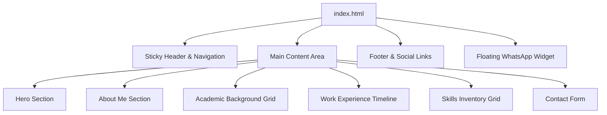

# System & Layout Architecture

This document describes the layout system, component structure, styling logic, and UI design patterns implemented in the career portfolio.

---

## 1. Component Breakdown

The application is structured as a modular single-page interface consisting of the following key visual blocks:



### 1.1 Header & Nav
- **Sticky positioning (`position: fixed`)** with a default height of `70px`.
- **Glassmorphic backing:** Uses `backdrop-filter: blur(12px)` and a slightly transparent white background (`rgba(255, 255, 255, 0.92)`) to allow content to show through softly as the user scrolls.
- **Scroll listener script:** Once the user scrolls past `50px`, the header gains a shadow class (`.scrolled`) and a thin border separator to delimit it from content.

### 1.2 Hero Section
- **Symmetrical Grid:** Two-column grid aligning professional text summary on the left and visual brand avatar on the right.
- **Background:** Soft radial mesh gradients (`#EBF8FF` / `#E6FFFA`) representing electrical energy lines.
- **Avatar brand ring:** Features dual keyframe-animated CSS rings to add micro-interactions:
  - `.avatar-ring`: Pulsating scale effect to simulate active current.
  - `.avatar-ring-outer`: Dashed spinning circle resembling a technical dial/rotary dial.

### 1.3 About Me
- **Layout:** Standard grid stack representing biological details on the left and four key project highlights (Site Coordination, Schedule, Safety, Costs) inside a clean card layout on the right.

### 1.4 Academics Grid
- **Responsive Flex/Grid Cards:** Cards wrap automatically on smaller screen sizes. Includes module listing using hover-scaled inline badges.

### 1.5 Work Experience Timeline
- **Vertical Line Timeline:** Built with a pseudo-element line (`::before`) on the left side.
- **Interactive Nodes:** Hovering over any job block scales up the chronological circular indicator node on the timeline line.
- **AutoCAD Schematic Showcase:** The Apex Electrical item includes an inline project layout image. The image is scale-hidden with a standard hover zoom animation.

### 1.6 Skills Inventory
- **Categorized grids:** Divided into Project Management, Electrical & Hardware Design, and Software & Systems.
- **Visual indicators:** Employs CSS progress bars representing level of competence, expanding smoothly via transition timers.

---

## 2. Layout Grid & Responsiveness

The system uses standard mobile-first media queries to control breakpoints:

| Viewport Range | Screen Width | Grid Columns | Navigation Type |
|:---|:---|:---|:---|
| **Mobile** | `< 768px` | 1 Column | Slide-out Hamburger Drawer |
| **Tablet** | `768px - 991px` | Variable (1 to 2 Cols) | Full Nav / Drawer Switch |
| **Desktop** | `992px - 1140px` | 2 Columns (Side-by-side) | Horizontal Inline Menu |
| **Widescreen** | `> 1140px` | 2 Columns (Max container width) | Horizontal Inline Menu |

---

## 3. Styling Logic & Variables

All styling is managed via CSS Custom Properties (`:root` variables) inside the document head. This allows global updates to the branding (e.g. changing the teal color to a different primary tone) in a single edit:

```css
:root {
    --color-primary: #2D3748;      /* Charcoal Slate */
    --color-accent-blue: #4A5568;  /* Muted Steel Blue */
    --color-accent-teal: #319795;  /* Muted Teal */
    --color-bg-white: #FFFFFF;     /* Crisp Warm White */
    --color-bg-light: #F7FAFC;     /* Soft Light Gray */
    --color-text-dark: #2D3748;
    --color-text-muted: #718096;
    --color-border: #E2E8F0;
    --color-success: #38A169;
}
```
